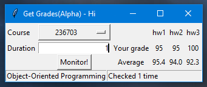

# GetGrades
Retrieve and monitor grades from gr++ site(Technion)

Just login and chose semester, course and duration for checks in minutes(for example 1 minute) and wait for sound alert.

###### Login screen

###### Main window

## How to run
1) python gui.py(make sure "requests" module already installed)
2) Standalone executable available in "dist" directory

### TODO

- [x] Add names to rows
- [ ] Get rid of winsound(in order to make app cross-platform)
- [ ] Android version

For now windows ONLY!
